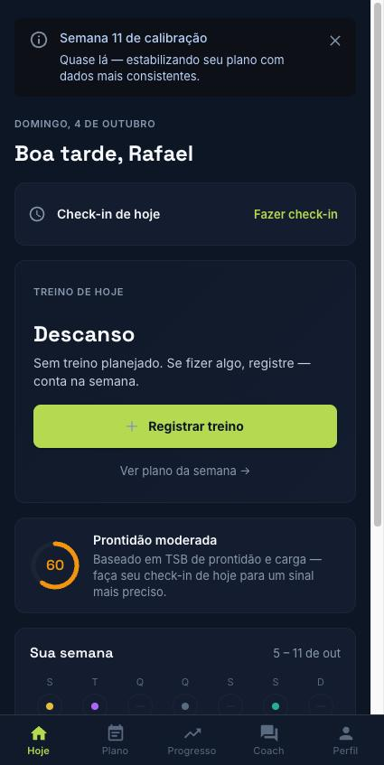

1. **Check-in**: responda **Como você acordou?** Toque em cada ícone (Sono, Humor, Dores, Energia e Estresse) para marcar como está; **Mais detalhes** abre campos extras. O app calcula sua prontidão de 0 a 100.
2. **Treino de hoje**: toque em **Ver etapas e começar** para ver as etapas, zonas e o perfil do treino.
3. Depois do treino, toque em **Concluí o treino** e responda **Como foi?** (percepção de esforço e sensações). Em cerca de um minuto aparece a **Análise do treino**, que seu treinador também vê.
4. Se não for treinar, toque em **Não vou conseguir hoje** e, se quiser, informe o motivo. O treinador vê isso no plano da semana.

*Check-in do dia: cinco itens, marcados com um toque*

*Aba Hoje: check-in, treino do dia e prontidão*
