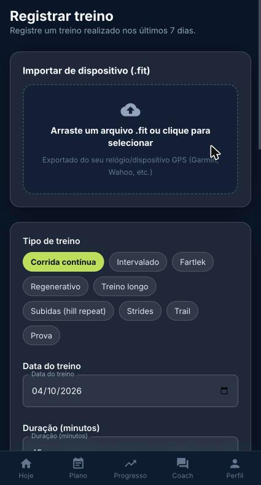

Se o treino não entrou sozinho, use **Registrar treino** (últimos 7 dias):

- **Importar de dispositivo (.fit)**: arraste ou selecione o arquivo exportado do relógio (Garmin, Wahoo etc.).
- **Manual**: tipo, data, duração, distância, percepção de esforço (RPE) e observações.

Treino feito sem estar no plano também conta na semana.

*Registrar treino: importar .fit ou lançar manualmente*
