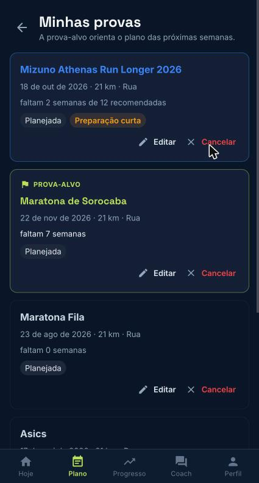

Em **Minhas provas**, toque em **Cadastrar prova**: nome, data (precisa ser futura), distância e tempo objetivo. Marque **Esta é a minha prova-alvo** para o plano mirar nela. Mudanças de data, distância ou alvo avisam seu treinador. Prova já realizada não pode ser alterada.

*Minhas provas*
