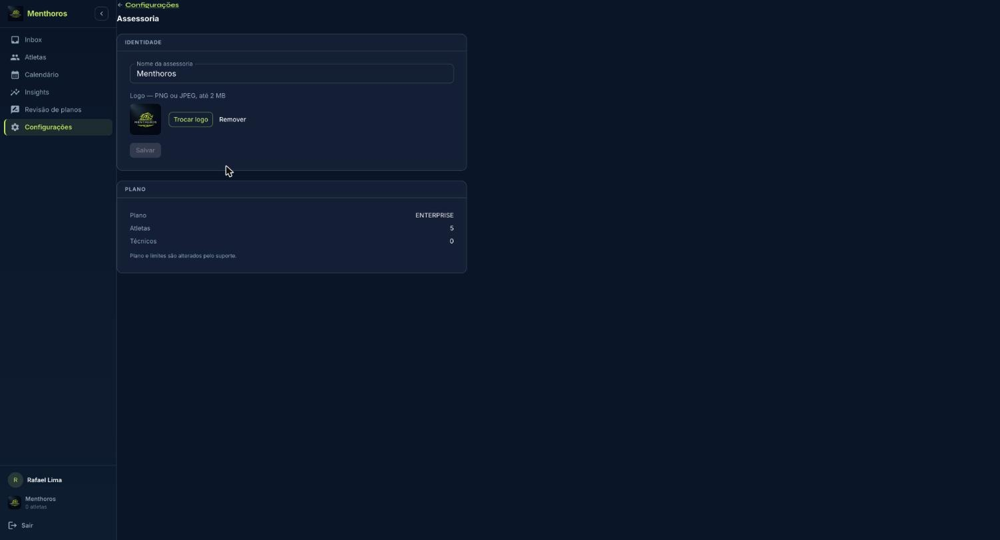

O Menthoros é a plataforma da assessoria de corrida: você planeja a semana do atleta, a IA propõe, você aprova, e o que o atleta corre volta para alimentar a carga e o próximo plano. **Nenhum plano chega ao atleta sem a sua aprovação.**

Este manual é para o treinador e o proprietário da assessoria, que usam o Menthoros no navegador, no computador (menu lateral). O atleta tem o próprio guia: [Guia do Atleta](/atleta/01-criar-conta/).

Termos usados em todo o manual:

- **Assessoria**: a organização do treinador. Todos os atletas, treinos e planos pertencem a uma assessoria.
- **Proprietário**: o treinador que criou a assessoria e cuida do nome, da logo e da assinatura.
- **Plano semanal**: os treinos de um atleta para uma semana, aprovados pelo treinador.
- **Treino realizado**: o que o atleta de fato correu, vindo do relógio (arquivo .fit), do intervals.icu, do Strava ou de lançamento manual.
- **Carga**: o TSS de cada treino, de onde saem condicionamento (CTL), cansaço (ATL) e forma (TSB).

Nomes de botões e telas aparecem **em negrito**, exatamente como estão no sistema.

O cadastro é só por convite e leva menos de dois minutos. Sem convite, você pode entrar na lista de espera da turma fundadora.

## Criar a assessoria

1. Abra o link do e-mail de convite. O sistema confere o convite antes de mostrar o formulário.
2. Preencha **Seu e-mail** (o mesmo que recebeu o convite), a senha, o **Nome da assessoria** e o **Identificador**.
   - O identificador aparece no endereço da assessoria. Use só letras minúsculas, números e hífens. Ex.: `corridasserra`.
3. Aceite os Termos de Uso e a Política de Privacidade e clique em **Criar assessoria**.
4. Confirme o e-mail de verificação e clique em **Ir para o login**.

Se aparecer **Convite inválido ou expirado**, peça um novo convite ou use **Entrar na lista de espera**.

## Primeiro acesso

1. Entre em **Acesse sua assessoria** com e-mail e senha.
2. Na janela **Antes de continuar**, marque o aceite dos Termos de Uso e o consentimento de tratamento de dados e clique em **Aceitar e continuar**. Sem esse aceite não é possível operar.
3. O assistente **Bem-vindo à Menthoros** pede dois passos: confirmar o nome da assessoria e **Cadastrar meu primeiro atleta**. Ambos podem ser feitos depois (**Pular por agora**).

## O menu do treinador

| Item do menu | Para que serve |
| --- | --- |
| **Inbox** | Tela principal: fila de atletas, diagnóstico, plano e provas de cada um |
| **Atletas** | Cadastro, convites, métricas de carga e ações em lote |
| **Calendário** | Treinos planejados da assessoria semana a semana |
| **Insights** | Visão agregada da assessoria nas últimas 12 semanas |
| **Revisão de planos** | Fila de planos gerados aguardando aprovação |
| **Configurações** | Assessoria, dados pessoais e privacidade |

## Configurar a assessoria

Em **Configurações › Configurar assessoria** você altera o nome e envia a logo (PNG ou JPEG, até 2 MB). Plano contratado e limites são alterados pelo suporte.

*Configurações da assessoria: nome, logo e plano contratado*

Em **Configurações** também ficam o consentimento registrado, o contato com o encarregado de dados (DPO) e **Solicitar exclusão de conta**, que é confirmada por e-mail antes de qualquer exclusão.
