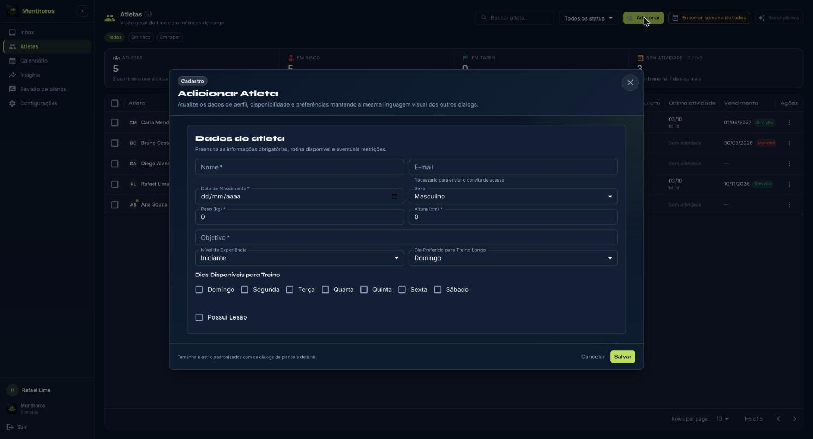
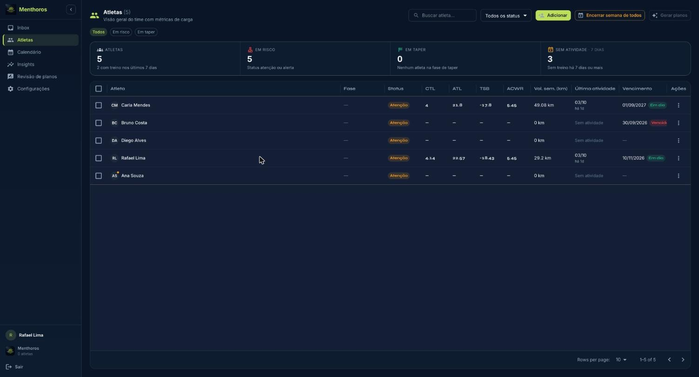
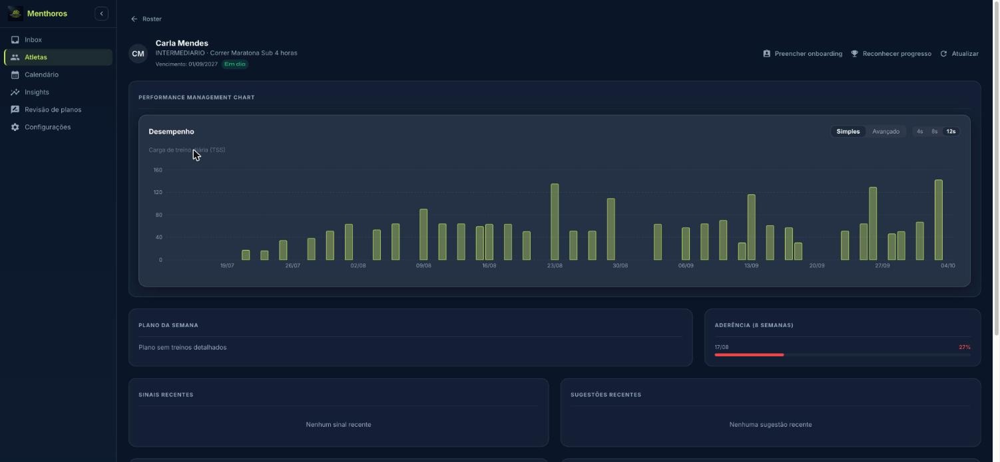

A tela **Atletas** é o roster da assessoria: cadastro, convite, métricas de carga e ações em lote.

## Cadastrar um atleta

1. Em **Atletas**, clique em **Adicionar**.
2. Preencha **Dados do atleta**: nome, e-mail (necessário para enviar o convite), data de nascimento, peso, altura, nível de experiência, objetivo, dias disponíveis, dia preferido para o treino longo e lesões, se houver.
3. Salve. O atleta aparece no roster.

*Formulário Adicionar Atleta*

## Convidar o atleta

1. No menu de ações do atleta, clique em **Enviar convite**.
2. Confirme. O atleta recebe um e-mail para criar a conta. Reenviar dispara outro e-mail.

## Onboarding do atleta

O questionário de onboarding molda o primeiro plano. O atleta pode respondê-lo no app, ou você pode preenchê-lo pelo perfil dele em **Preencher onboarding**. São cinco etapas: perfil (experiência, relógio, canal de integração), objetivo, disponibilidade (dias, duração por sessão, volume semanal confortável), saúde (lesões atuais e histórico) e prova-alvo.

## Ler o roster

| Coluna | O que mostra |
| --- | --- |
| CTL | Carga de treino crônica (condicionamento) |
| ATL | Carga de treino aguda (cansaço) |
| TSB | Balanço de estresse (forma) |
| ATL/CTL | Razão carga aguda:crônica, indicador de risco de lesão |
| Vol. sem. (km) | Volume da semana |
| Última atividade | Data do último treino realizado |

Use a busca, o filtro de status (**Ativo**, **Atenção**, **Alerta**, **Pausado**) e os atalhos **Em risco** e **Em taper**. **Exportar** baixa a lista.

*Tela Atletas: roster com métricas de carga, status e vencimento*

## Dados dos treinos realizados

Os treinos realizados entram por quatro fontes, sem ação do treinador quando o atleta está conectado:

- **intervals.icu**: o atleta autoriza a conexão no app. Os treinos aprovados também são enviados ao calendário dele e chegam ao relógio Garmin.
- **Strava**: pelo menu do atleta, **Sincronizar Strava** importa os últimos 90 dias.
- **Arquivo .fit**: o atleta importa pelo app.
- **Manual**: o atleta registra no app.

O status de envio de cada treino aparece como **No relógio**, **Envio pendente**, **Erro no envio** ou **Não conectado**.

## Perfil do atleta

Clique no nome do atleta para abrir o perfil: gráfico de performance (PMC), plano da semana, aderência em 8 semanas, sinais recentes, sugestões da IA, treinos recentes com RPE e sensações, melhores esforços (requer intervals.icu) e revisão semanal. **Reconhecer progresso** envia um reconhecimento ao atleta (Consistência, Superação ou Volta por cima).

*Perfil do atleta com o gráfico de desempenho (TSS diário)*

## Contrato e mensalidades do atleta

No perfil, a seção de cobrança registra a relação comercial com o atleta. O Menthoros só registra: o dinheiro circula fora da plataforma.

1. **Criar contrato**: periodicidade (mensal, trimestral, semestral ou anual), valor, início e **Dia do vencimento**. Marque **Avisar o atleta por e-mail antes do vencimento** se quiser o lembrete.
2. As **Mensalidades** são geradas automaticamente enquanto o contrato estiver ativo, com status **Em aberto**, **Vencida**, **Paga** ou **Cancelada**.
3. Quando o atleta pagar, clique em **Dar baixa**. Nada dá baixa automaticamente.
4. **Encerrar contrato** interrompe novas mensalidades; as em aberto continuam.
