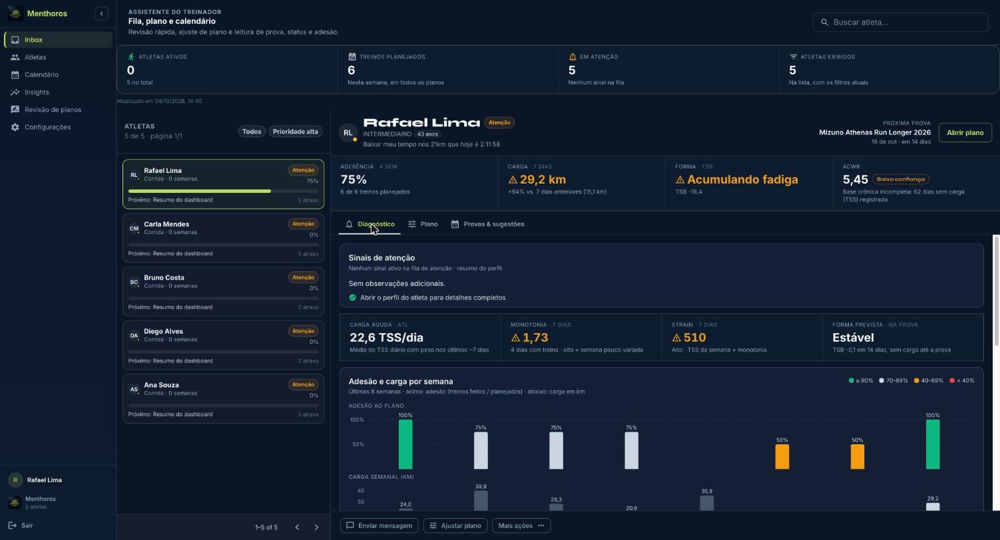
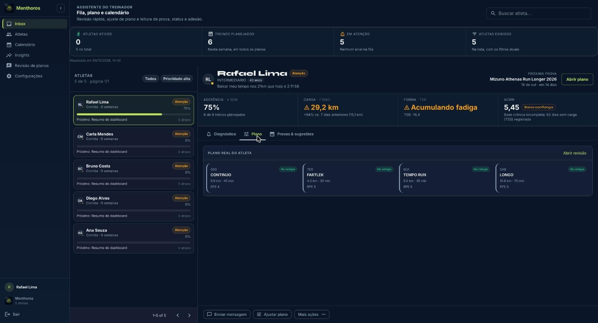
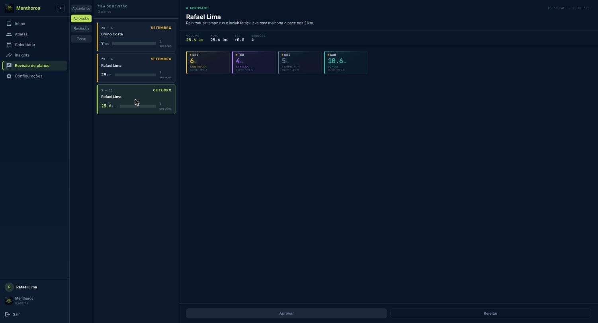

Toda semana o ciclo é o mesmo: a IA gera os planos, você revisa e aprova, o atleta executa, você encerra a semana e o próximo plano usa o que aconteceu.

1. **Gerar planos** da próxima semana (individual ou em lote).
2. **Revisar** cada plano: editar, adicionar ou excluir treinos.
3. **Aprovar** ou **Rejeitar** com motivo. Só o plano aprovado aparece para o atleta e é enviado ao relógio.
4. **Acompanhar** a execução pela Inbox: aderência, carga, sinais e check-ins.
5. **Encerrar semana**. A revisão semanal alimenta a geração seguinte, e o ciclo recomeça.

## Inbox: quem precisa de você agora

A **Inbox** (Assistente do Treinador) lista os atletas à esquerda e o detalhe do atleta selecionado à direita.

- Filtre por status (**Ativo**, **Atenção**, **Alerta**, **Pausado**) e ordene por **Prioridade**, **Aderência**, **Carga** ou **Próxima prova**.
- O detalhe tem três abas:
  - **Diagnóstico**: forma diária (PMC), limiares inferidos dos últimos 30 dias (FC e pace limiar), aderência e carga por semana, sinais de atenção com evidência e ação sugerida, e o próximo treino.
  - **Plano**: o plano vigente do atleta, com atalho para **Abrir revisão**.
  - **Provas & sugestões**: provas do atleta, estimativa de tempo e sugestões recentes da IA.
- Ações rápidas: **Ajustar plano**, **Marcar como prioridade**, **Rejeitar plano** e **Enviar mensagem**. A mensagem gera um rascunho que você copia e cola no seu canal com o atleta (ex.: WhatsApp).

*Inbox, aba Diagnóstico: aderência, carga, forma, ACWR e adesão por semana*

*Inbox, aba Plano: treinos da semana com status de envio ao relógio*

## Gerar planos

- **Um atleta**: no perfil ou na aba Plano, clique em **Gerar Plano** e escolha **Próxima semana** ou **Semana atual**. Só existe um plano ativo por atleta e semana; para gerar outro, encerre a semana.
- **Em lote**: em **Atletas**, selecione os atletas e clique em **Gerar planos**. Confirme o lote. Pode fechar a janela: o progresso aparece na linha de cada atleta (**Gerando plano…**, **Plano gerado agora** ou **Falha ao gerar**). Retomar um lote pula quem já tem plano ativo.

Todo plano gerado entra como **Aguardando** revisão.

## Revisar e aprovar

Em **Revisão de planos**, a fila tem três abas: **Aguardando**, **Aprovados** e **Rejeitados**.

*Revisão de planos: fila à esquerda, plano da semana à direita, Aprovar e Rejeitar no rodapé*

1. Selecione o plano. Cada dia mostra o treino ou o descanso com o motivo.
2. Ajuste o que for preciso:
   - **Editar treino**: tipo, etapas, distância, duração, zona alvo e observação. O TSS planejado é calculado automaticamente.
   - **Adicionar treino** ou **Prescrever treino neste dia** num dia de descanso.
   - **Excluir treino**.
3. Clique em **Aprovar**, ou em **Rejeitar** informando o motivo, que entra no histórico do plano.

Um plano aprovado pode ser **reaberto** automaticamente quando o atleta insere ou remove uma prova.

## Montar um treino

Tipos disponíveis: Fácil, Contínuo, Longo, Tempo Run, Intervalado, Fartlek, Regenerativo, Tiro e Subida.

O treino é montado em etapas (aquecimento, principal, intervalado, recuperação, desaquecimento). Use **Etapa simples** para um trecho único e **Bloco repetido** para séries (ex.: 6 × [800 m Z4 + 2 min Z1]). Cada etapa tem distância ou duração e zona alvo. O **Perfil do treino** mostra a timeline das etapas, o IF e o TSS. Se faltar aquecimento ou desaquecimento, o sistema avisa antes de salvar.

## Sugestões da IA

Além dos planos, a IA propõe sugestões pontuais: **Novo plano**, **Ajuste de plano**, **Recuperação**, **Simulação de prova** e **Resposta a lesão**. Cada uma traz nível de confiança, justificativa e prazo de expiração. Você decide: **Aprovar** ou **Rejeitar**.

## Provas e projeção de tempo

As provas são cadastradas pelo atleta ou pelo treinador. A prova-alvo orienta o plano das próximas semanas, e uma preparação abaixo do recomendado aparece como **Preparação curta**.

Em **Projeção de prova**, escolha as distâncias e a fase de periodização e clique em **Gerar Projeção**. O resultado traz tempo e pace projetados, intervalo de ±3%, confiança e CTL/TSB previstos no dia da prova. O atleta só vê a projeção depois que você clica em **Marcar como Oficial**.

## Encerrar a semana

Clique em **Encerrar semana** no atleta, ou selecione vários em **Atletas** e use **Encerrar semana de todos**. Confira o resumo do impacto e confirme. Depois do encerramento, a **Revisão semanal** aparece no perfil e o botão **Gerar plano da próxima semana** fica disponível.
