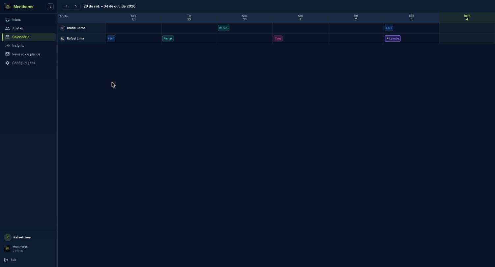
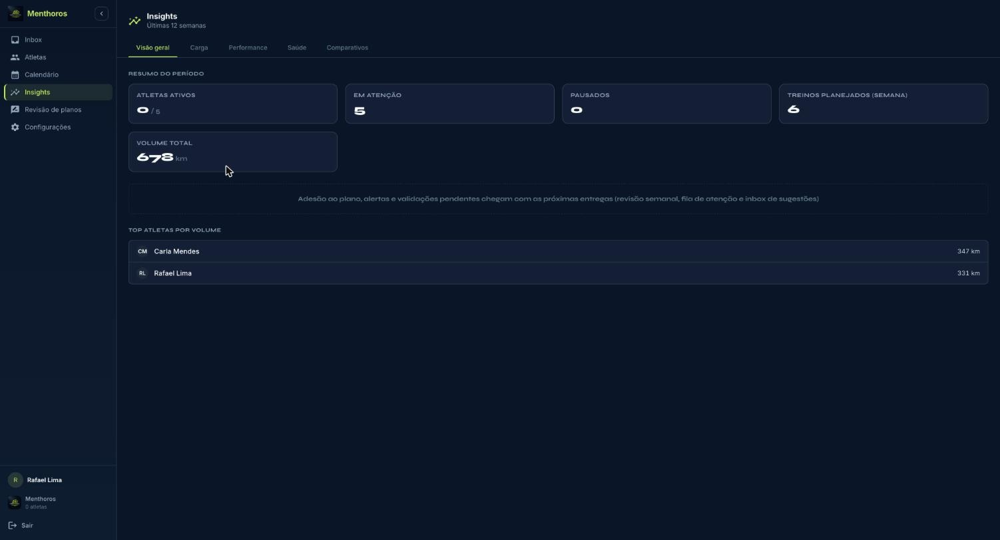

## Calendário

Mostra os treinos planejados de todos os atletas na semana. Navegue com **Semana anterior** e **Próxima semana**.

*Calendário semanal da assessoria*

## Insights

Visão da assessoria nas últimas 12 semanas: atletas ativos, atletas em atenção, treinos planejados na semana, volume total, carga (TSS) e volume (km) por semana, e os atletas com maior volume. As abas **Carga**, **Performance**, **Saúde** e **Comparativos** estão sendo liberadas aos poucos; algumas ainda mostram "em breve".

*Insights, Visão geral: resumo do período e top atletas por volume*

## Assinatura da assessoria

Durante a fase fundadora, o acesso é gratuito. Plano contratado e limites são alterados pelo suporte; em **Configurações › Configurar assessoria** você vê o plano e o uso atual.

Não confunda com o **contrato do atleta** (seção Atletas): a assinatura é a relação da assessoria com o Menthoros; o contrato é a relação do atleta com a assessoria.
